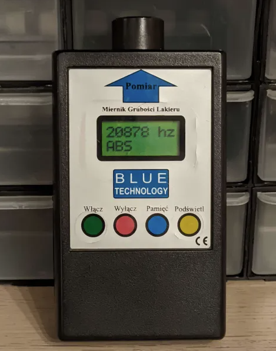

# PaintDepthGauge

Firmware for Blue technology MGR-10FE electronic paint depth gauge

## Usage

* Find a suitable place on the car body to measure the paint depth.
* Press the blue button to switch to relative mode, you should see near 0 hz.
* Find a different place on the car body see the difference in frequency.

## Help needed!

I dont have calibration paint samples. Without these my firmware can only display the raw frequency from the sensor. Please contact me if you have calibration samples and can help me to calibrate the device.

## How to build

Use Arduino IDE to build and upload the firmware.

Use MiniCore board settings for ATmega8 with 8MHz external crystal.